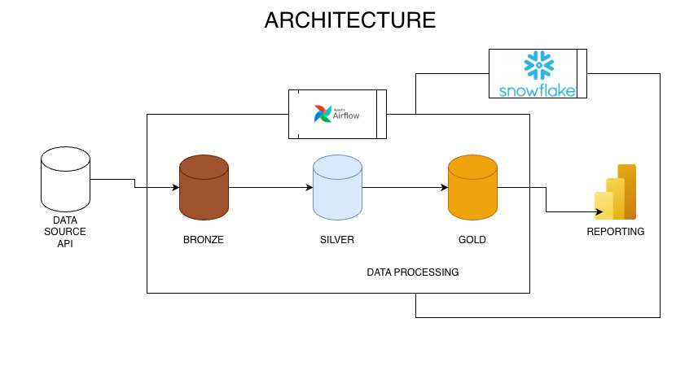
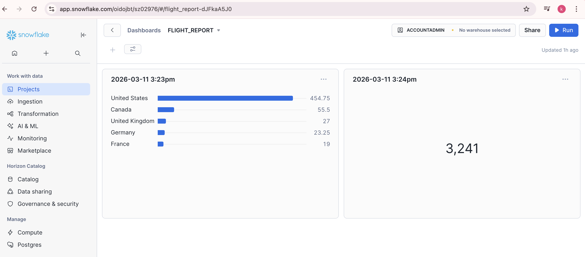

# Flight Operation Pipeline with Airflow & Snowflake

## Project Overview
This project implements a **Flight Operations Data Pipeline** using **Apache Airflow** for orchestration and **Snowflake** as the target data warehouse. The pipeline ingests raw flight data, processes it through a **medallion architecture** (Bronze → Silver → Gold), and loads aggregated KPIs into Snowflake.

The pipeline ensures:

- Efficient ingestion and processing of flight telemetry data.
- Aggregation and transformation of flight metrics.
- Seamless integration with Snowflake for analytics and reporting.

---
[](https://www.python.org/)  
[](https://airflow.apache.org/)  
[](https://www.snowflake.com/)  

---
## Achitecture


---

## Overview
This project implements a **Flight Operations Data Pipeline** using **Apache Airflow** for orchestration and **Snowflake** as the target data warehouse.  
It follows a **medallion architecture**:

- **Bronze**: Raw JSON flight data ingestion  
- **Silver**: Data cleaning and standardization  
- **Gold**: Aggregated KPIs per `origin_country`  

Aggregated data is uploaded to Snowflake for analytics.

---

## Features
- Fully automated Airflow DAG orchestration  
- KPI aggregation (flights, velocity, altitude)  
- UPSERT into Snowflake for incremental loads  
- Supports dynamic execution dates  

---


---

## Technologies Used

- **Apache Airflow** – Pipeline orchestration  
- **Python** – Data processing and Airflow operators  
- **Pandas** – Data transformation and aggregation  
- **Snowflake** – Cloud Data Warehouse  
- **time_machine** – For handling timestamps  
- **Git & GitHub** – Version control  

---
## Business Analysys with POWER BI


---

## Setup & Installation

1. **Clone the repository**
```bash
git clone https://github.com/Lekwacious-dev/Flight_Operation_Airflow_Snowflakes.git
cd FlightOperation

- Install dependencies

pip install -r requirements.txt

- Initialize Airflow

export AIRFLOW_HOME=$(pwd)/airflow_home
airflow db init

- Add Snowflake connection in Airflow UI:
Connection ID: flight_snowflake_conn
Type: Snowflake
Provide credentials, warehouse, database, schema, and role
Start Airflow
airflow scheduler
airflow webserver

---

## Snowflake Integration

Gold layer is uploaded to Snowflake into:
DATABASE: FLIGHTS
SCHEMA: KPI
TABLE: FLIGHT_KPIS


